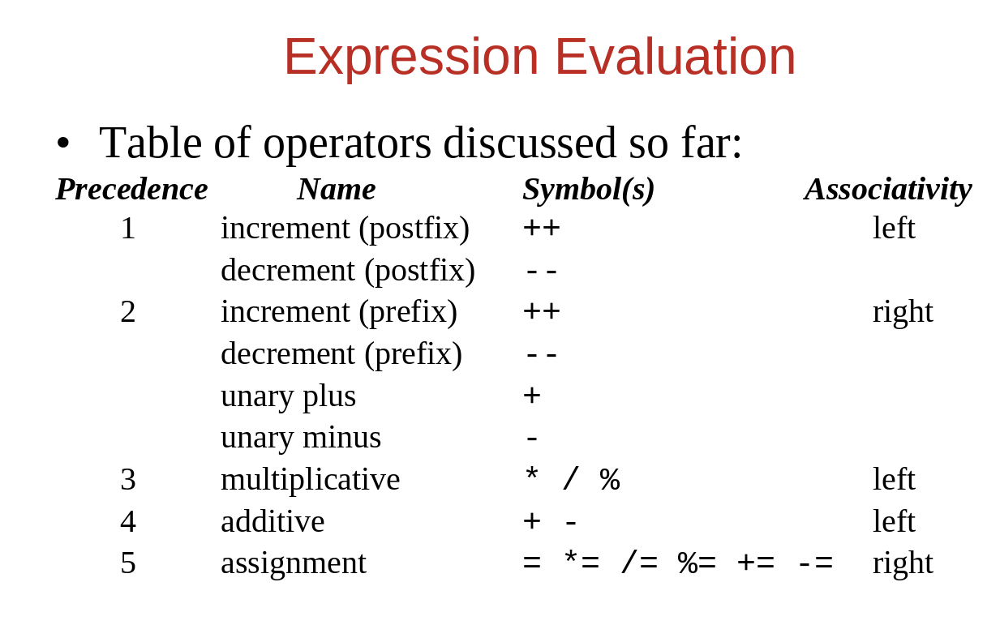

# Arithmetic Operators

Modulus Operator only accepts integer operands and for divison operator if both operands are integer result of division will be the integer part of the result

- `+`: addition
- `-`: subtraction
- `*`: multiplication
- `/`: division
- `%`: modulus

```C
int i=3,j=2;
float x=1.2, y=1.5;

printf("%d\n", i+j);
printf("%f\n", i+x);
printf("%f\n", x+y);

printf("%d\n", i-j);
printf("%f\n", i-x);
printf("%f\n", x-y);

printf("%d\n", i*j);
printf("%f\n", i*x);
printf("%f\n", x*y);

printf("%d\n", i/j);
printf("%f\n", i/x);
printf("%f\n", x/y);


printf("%d\n", i%j);
```

output:

```Console
4.200000
2.700000
1
1.800000
-0.300000
6
3.600000
1.800000
1
1.500000
2.500000
0.800000
1
2.500000
0.800000
```

using `%` with floats will produce error:

```C
printf("%f\n", i/x); // wrong
printf("%f\n", x/y); // wrong
```

To find the exact result of division of two integers we have to do conversion:

```C
printf("%f\n", (float)i/j);
```

output:

```Console
1.500000
```

## Unary Operator

unary operator are right associative:(evaluate from right to left)
`-+i` is equal to `-(+i)`

- `+`
- `-`

```C
int i = 1;
int j = -i;
```

## Assignment Operator

Example: In `v=e` value of assignment is the same as `v`
assignment operator is right associative which means start evaluation from right and continue to left:

```C
i = j = 0;
```

is same as:

```C
j = 0;
i = j;
```

left of the assignment can not be a statement or number. Examples of wrong assignment:

```C
2 = i;
i + j = 0;
-i = j;
```

### Compound Assignment

- `x+=2` is the same as `x = x + 2`
- `x-=2` is the same as `x = x - 2`
- `x*=2` is the same as `x = x * 2`
- `x/=2` is the same as `x = x / 2`
- `x%=2` is the same as `x = x % 2`

## Increment and Decrement

- `++i`: pre-increment (first increments then returns the value)
- `i++`: post-increment (first uses then old value then increments)
- `--i`: pre-decrement
- `i--`: post-decrement

```C
int i,j,k;
i=1;
j=2;
k=++i,j++;
printf("%d, %d, %d",i,j,k);
```

output:

```Console
2, 3, 2
```

## Operator Precedence


